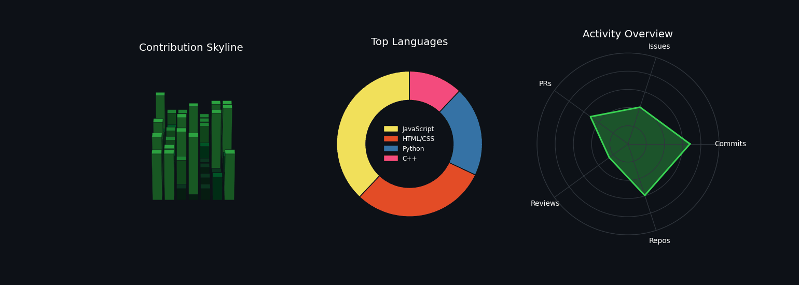

<p align="center">
  
</p>

<p align="center">
  
</p>

<p align="center">
  <a href="https://www.linkedin.com/in/satendra-jha-933139380" target="_blank">
    
  </a>
  
</p>

---

### 🚀 About Me

- 🎓 BCA Student at **Guru Kashi University**
- 💻 Full Stack Web Developer — building responsive, user-friendly web apps
- 📊 Also diving into **Data Analytics** — SQL, Python (Pandas), and dashboards
- 🌱 Currently learning **React, Node.js, Python, and SQL**
- 🔧 I love building projects and constantly picking up new technologies
- 📍 Based in Bathinda, Punjab, India

---

### 🛠️ Web Development Stack

<p align="left">
  
  
  
  
  
  
  
  
</p>

### 📊 Data Analytics Stack

<p align="left">
  
  
  
  
  
  
  
</p>

---

### 📈 Skill Progress

**Web Development**
```
HTML/CSS      ████████████████████░░░░  85%
JavaScript    ████████████████░░░░░░░░  70%
React         ██████████████░░░░░░░░░░  60%
Node.js       ████████████░░░░░░░░░░░░  50%
```

**Data Analytics**
```
SQL           ██████████████░░░░░░░░░░  60%
Python        ████████████░░░░░░░░░░░░  50%
Excel         ██████████████████░░░░░░  75%
Power BI      ██████████░░░░░░░░░░░░░░  40%
```

---

### 📂 Featured Projects

**🌐 Web Development**

| Project | Description |
|---|---|
| [LUGX Gaming Website](https://github.com/Satendra-459/LUGX_Gamming_project) | Responsive gaming website front-end built with HTML, CSS & JavaScript |
| [Personal Portfolio Website](https://github.com/Satendra-459/Satendra-Portfolio-Website) | Modern, responsive portfolio site |
| [Love Animation](https://github.com/Satendra-459/love-animation) | Romantic countdown animation using HTML, CSS & JS |

**💻 Programming / Logic Building**

| Project | Description |
|---|---|
| [Tic-Tac-Toe (C++)](https://github.com/Satendra-459/Tic-Tac-Toe-Game-in-C-) | Classic command-line Tic-Tac-Toe game |
| [Arithmetic Calculator (C++)](https://github.com/Satendra-459/-Simple-Arithmetic-Calculator-in-C-) | Console-based calculator for basic operations |
| [Number Guessing Game (C++)](https://github.com/Satendra-459/Number-Guessing-Game-in-C-) | Simple console-based number guessing game |

**📊 Data Analytics** *(in progress)*

| Project | Description |
|---|---|
| 🚧 Coming soon | Working on SQL + Python based data analysis projects |

---

### 📊 Contribution Overview

<p align="center">
  
</p>

---

### 📫 Connect With Me

<p align="left">
  <a href="https://www.linkedin.com/in/satendra-jha-933139380" target="_blank">
    
  </a>
  <a href="mailto:jhasatendra906@gmail.com">
    
  </a>
</p>

<p align="center">⭐ I'm actively looking for Full Stack Web Developer  internship / entey-level opportunities . If you're hiring or just want to talk data , reach out !</p>
